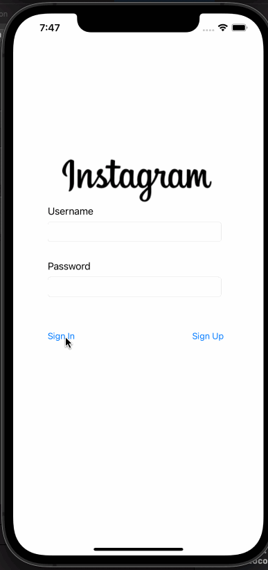
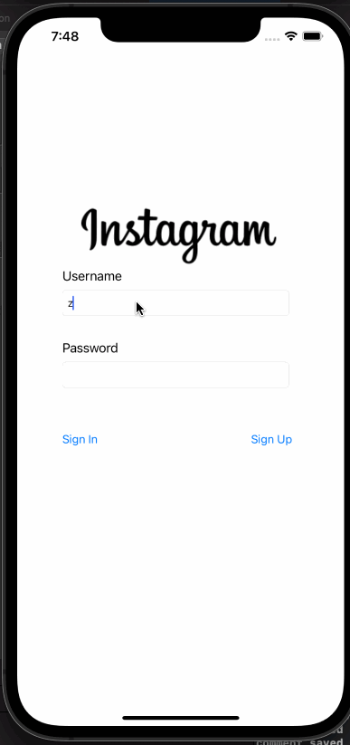

# Parstagram - Part I

This is an Instagram clone with a custom Parse backend that allows a user to post photos and view a global photos feed.

Time spent: **3** hours spent in total

## User Stories

The following **required** functionality is completed:

- [X] User sees app icon in home screen and styled launch screen. (1pt)
- [X] User can sign up to create a new account. (1pt)
- [X] User can log in. (1pt)
- [X] User can take a photo, add a caption, and post it to the server. (3pt)
- [X] User can view the last 20 posts. (4pts)

# Parstagram - Part II

This is an Instagram clone with a custom Parse backend that allows a user to post photos, view a global photos feed, and add comments!

Time spent: **3** hours spent in total

## User Stories

The following **required** functionality is completed:

- [X] User stays logged in across restarts. (1pt)
- [X] User can log out. (1pt)
- [X] User can view comments on a post. (3pts)
- [X] User can add a new comment. (5pts)

## Video Walkthrough

Here's a walkthrough of implemented user stories:

## License

    Copyright [2021] [ZhanpZ]

    Licensed under the Apache License, Version 2.0 (the "License");
    you may not use this file except in compliance with the License.
    You may obtain a copy of the License at

        http://www.apache.org/licenses/LICENSE-2.0

    Unless required by applicable law or agreed to in writing, software
    distributed under the License is distributed on an "AS IS" BASIS,
    WITHOUT WARRANTIES OR CONDITIONS OF ANY KIND, either express or implied.
    See the License for the specific language governing permissions and
    limitations under the License.

